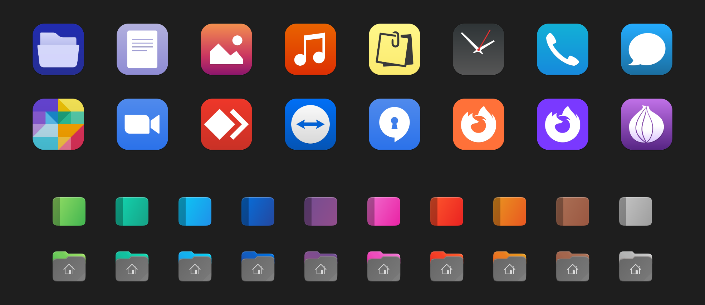

# Gnomint icon theme

## Additions

- New icons: Fragments / Zoom / AnyDesk
- New variants: Firefox Nightly / System File Manager
- Symlinks to existing icons for the Gnome apps and other new apps
- Symlinks to fix new icon names (like with Flathub apps)

*Differences full list in the 'DIFF' file*

## Cinnamon

Gnomint is compatible with the brand new Cinnamon Style and Folder Color Switcher functions!

It is highly recommended to use this icons pack with the "Mint-Y" graphical themes installed.

## Credits

- 'Gnomint' (apps) is based on 'Mint-Y' by the 'Linux Mint Team' --> [https://github.com/linuxmint/mint-y-icons](https://github.com/linuxmint/mint-y-icons)
- 'Gnomint' (other) is based on 'Yaru-Colors' by 'Jannomag' --> [https://github.com/Jannomag/Yaru-Colors](https://github.com/Jannomag/Yaru-Colors)
- 'Mint-Y' (apps) is based on 'Moka' by 'Sam Hewitt' --> [https://github.com/snwh/moka-icon-theme](https://github.com/snwh/moka-icon-theme)
- 'Yaru-Colors' is based on 'Yaru' by the 'Ubuntu Community' --> [https://github.com/ubuntu/yaru](https://github.com/ubuntu/yaru)
